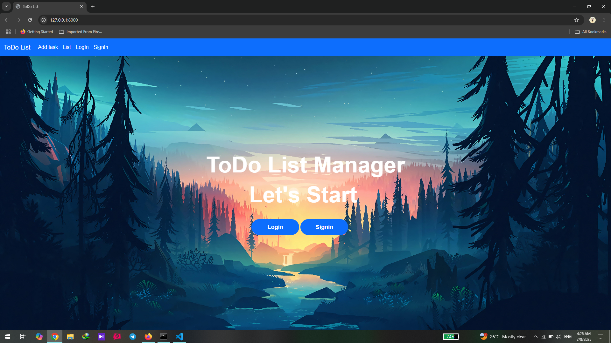
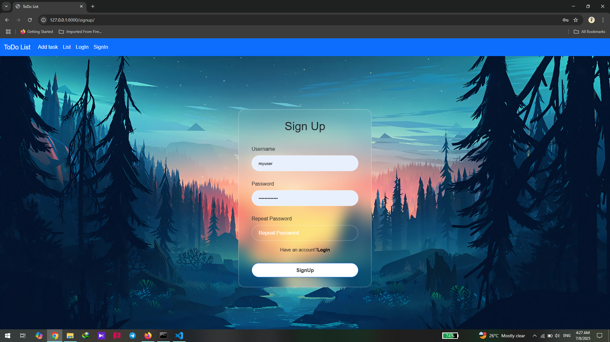

# Online ToDo List Manager
> An online todo list manager with signup and login
# Description

The Online Todo List Manager is a user-friendly task management tool designed to help your daily activities efficiently. Built with modern web technologies,Django for backend and  html,css and bootstrap for frontend. this application provides a clean interface for users to create, edit, and manage their tasks easily.Also used [Django REST framework](https://www.django-rest-framework.org/) for making the CRUD API of web site.
# Demo:
### Homepage


### Signup page

## 🚀 Features

- **Add Tasks**: Easily add new tasks to your list.
- **Edit Tasks**: Modify existing tasks to update their details.
- **Delete Tasks**: Remove tasks that are no longer needed.
- **Mark as Completed**: Keep track of completed tasks for better organization.
- **Filter results**: You can fillter task to completed or pending.
- **Signup users**: Users can easily signup and make account.
- **Login users**: Users can login and check on theirworks.
- **CRUD API**: This project has API that developers can use it.
- **Responsive Design**: Have good UI,enjoy using.
## Installation:
**1.Clone the Repo**
```sh
git clone https://github.com/SMojtabaE/todolist.git
cd /ToDoList
```
**2.Setup venv & Install Requirements**
```sh
python -m venv .venv        # Create new venv
.venv\Scripts\Activate.ps1  # Activate venv in windows
pip install -r requirements.txt
```

**3.Migrate Database**
```sh
cd todolist/
python manage.py makemigrations
python manage.py migrate
```
**4.Start Server**
```sh
python manage.py runserver
```
# Contributors
Contributions are welcome, and they are greatly appreciated! Every little bit helps, and credit will always be given.<br/>

Please star the repo and feel free to make pull requests.